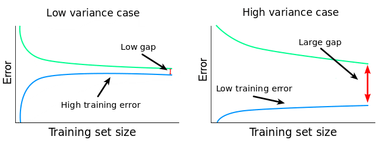

In applied machine learning, especially in fields like genomics where data collection is expensive, one of the most consequential decisions you make is whether to invest in more data or a better model.

Learning curves are a diagnostic that helps you answer this empirically. They won't predict exactly what happens at a sample size you haven't reached, but they will tell you whether you're in a regime where more data is likely to help, and that's usually the decision that matters.

## What a Learning Curve Is

A learning curve plots model performance as a function of training set size. You train the same model on progressively larger subsets of your data, recording **both the training score and the validation score** at each size.

The relationship between these two lines is the diagnostic. Plotting only the validation score tells you how well the model performs. Plotting both tells you **why** — and more importantly, what to do about it.

## Reading the Bias-Variance Gap

### High Variance: The Gap is Wide

If the training error is low but the validation score is substantially higher, the model is overfitting, memorising training data rather than learning generalisable patterns. In high-dimensional settings like methylation data (hundreds of thousands of features, hundreds of samples), this is the default starting point.

The key question is whether the gap narrows as you add data. If it does, **more samples will help**. The model has the capacity to learn the signal - it just needs more examples to separate signal from noise.

If the gap stays wide regardless of sample size, more data alone won't help. You need stronger regularisation or dimensionality reduction first.

### High Bias: Both Errors are high

If both training and validation errors are high and close together, the model can't capture the signal. It's underfitting. More data won't fix this. You need a more expressive model, better features, or to revisit whether the signal exists in this feature space at all.

### Convergence: Where They Meet

The ideal pattern: the training error gradually increases (overfitting becomes harder) and the validation score gradually decreases (the model learns more). The two curves converge.

Where they converge is the performance ceiling for your current model and features. If they've nearly met at 300 samples, collecting another 500 is unlikely to close the remaining gap. If there's still a visible gap at your current sample size, there's room to improve by collecting more.

In summary:

- **Wide gap, narrowing** — collect more data.
- **Wide gap, static** — fix the model first.
- **Narrow gap, high errors** — the model is underfitting. Change approach.
- **Narrow gap, acceptable errors** — you have enough data.

## What Learning Curves Can and Can't Tell You

Learning curves are a diagnostic, not a forecast. They show you the trend within the data you already have, whether performance is still climbing, whether the model is overfitting or underfitting, and whether the gap between training and validation is closing. What they can't do is reliably extrapolate. If you have 300 samples and the curve is still climbing, you know more data would help, but you can't precisely predict what performance looks like at 1,000. The curve could plateau at 400 or keep climbing to 800.

That said, the diagnostic is still enormously useful for decision-making. Define what "good enough" means before generating the curves, for example, *R^2=0.4* for the model to be commercially viable. Then ask: is the curve still climbing at my current sample size, or has it flattened? Is the training-validation gap wide or narrow?

This converts a data science analysis into a directional business case: "Performance is still improving and the model is clearly overfitting. More data is the right investment" or "The curve has flattened and both errors are high. We should invest in better features or a different model class before collecting more samples."
